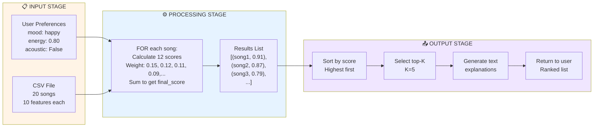

# 🎵 Data Flow Visualization: Music Recommender System

## System Architecture Overview

```
                    ┌─────────────────────────────────────┐
                    │     MUSIC RECOMMENDER SYSTEM        │
                    └─────────────────────────────────────┘
                                    │
                 ┌──────────────────┼──────────────────┐
                 │                  │                  │
            ┌────▼────┐        ┌────▼────┐        ┌───▼─────┐
            │  INPUT  │        │ PROCESS │        │ OUTPUT  │
            └────┬────┘        └────┬────┘        └───┬─────┘
                 │                  │                  │
         User Preferences    Scoring Logic      Ranked Results
         (6+ fields)         (12 features)      (Top-K songs)
```

---

## Detailed Data Flow

### STAGE 1: INPUT — User Preferences

**User Profile Dictionary:**
```python
user_prefs = {
    "mood": "happy",                    # Target mood
    "energy": 0.80,                     # Target energy (0.0-1.0)
    "acoustic_preference": "electronic" # Acoustic vs. Electronic
}
```

**What Got Here:**
- User selects/provides preferences
- System validates format
- Defaults applied if missing

---

### STAGE 2: PROCESS — The Scoring Loop

**For Each Song in CSV:**

```python
LOOP through all_songs:
    song = read_next_song_from_csv()
    
    # Calculate 12 feature similarities
    energy_score = 1.0 - |song.energy - user.target_energy|
    mood_score = 1.0 if song.mood == user.mood else 0.5
    genre_score = 1.0 if song.genre == user.favorite_genre else 0.5
    acoustic_score = compute_acoustic_fit(song, user)
    dance_score = compute_danceability_bonus(song, user)
    valence_score = compute_valence_fit(song, user)
    popularity_score = compute_popularity_fit(song, user)
    decade_score = compute_decade_fit(song, user)
    mood_tags_score = compute_mood_tags_fit(song, user)
    instrumental_score = compute_instrumental_fit(song, user)
    speechiness_score = compute_speechiness_fit(song, user)
    context_score = compute_context_fit(song, user)
    
    # Combine with weights (all 12 sum to 1.0)
    final_score = (
        0.15 * energy_score +
        0.12 * mood_score +
        0.11 * genre_score +
        0.09 * acoustic_score +
        0.09 * dance_score +
        0.07 * valence_score +
        0.08 * popularity_score +
        0.06 * decade_score +
        0.08 * mood_tags_score +
        0.06 * instrumental_score +
        0.05 * speechiness_score +
        0.04 * context_score
    )
    
    # Store result
    results.append((song, final_score))

END LOOP
```

---

### STAGE 3: OUTPUT — Ranking

**After All Songs Scored:**

```python
# Sort by score (highest first)
ranked_songs = sorted(results, key=lambda x: x[1], reverse=True)

# Take top-K
top_k = ranked_songs[:k]

# Generate explanations
for song, score in top_k:
    explanation = build_explanation(song, user)
    output.append((song, score, explanation))
```

---

## Mermaid Flowchart: Complete Data Flow

```mermaid
flowchart TD
    Start([User Initiates Recommendation]) --> UserInput["📋 INPUT: User Preferences<br/>mood: happy<br/>energy: 0.80<br/>acoustic: electronic"]
    
    UserInput --> LoadCSV["📂 LOAD: CSV File<br/>20 songs from data/songs.csv<br/>10 features per song"]
    
    LoadCSV --> InitLoop["🔄 INITIALIZE<br/>results = []<br/>song_index = 0"]
    
    InitLoop --> BeginLoop{"🔄 MORE SONGS?<br/>song_index < total_songs"}
    
    BeginLoop -->|YES| ReadSong["📖 READ SONG<br/>Extract: energy, mood,<br/>acousticness, danceability,<br/>valence, genre, etc."]
    
    ReadSong --> CalcEnergy["⚡ SCORE ENERGY<br/>similarity = 1 - |0.82 - 0.80|<br/>= 0.98"]
    
    CalcEnergy --> CalcMood["😊 SCORE MOOD<br/>happy == happy?<br/>score = 1.0"]
    
    CalcMood --> CalcAcoustic["🎸 SCORE ACOUSTICNESS<br/>user prefers electronic<br/>score = 1 - 0.18 = 0.82"]
    
    CalcAcoustic --> CalcDance["💃 SCORE DANCEABILITY<br/>happy mood gets full score<br/>score = 0.79"]
    
    CalcDance --> CalcValence["🎭 SCORE VALENCE<br/>happy mood = higher valence<br/>score = 0.84"]
    
    CalcValence --> OtherFeatures["🎯 SCORE OTHER FEATURES<br/>Genre, Acousticness, Danceability,<br/>Popularity, Decade, Mood Tags,<br/>Instrumentalness, Speechiness, Context"]
    
    OtherFeatures --> WeightSum["⚖️  COMBINE 12 WEIGHTS<br/>15×Energy + 12×Mood + 11×Genre +<br/>9×Acoustic + 9×Dance + 7×Valence +<br/>8×Popularity + 6×Decade + 8×Tags +<br/>6×Instrumental + 5×Speech + 4×Context<br/>TOTAL = 0.91"]
    
    WeightSum --> StoreResult["💾 STORE RESULT<br/>(song_obj, score=0.91)"]
    
    StoreResult --> NextSong["↻ NEXT SONG<br/>song_index += 1"]
    
    NextSong --> BeginLoop
    
    BeginLoop -->|NO| SortResults["🔀 SORT BY SCORE<br/>[(Sunrise City, 0.91)<br/> (Rooftop Lights, 0.87)<br/> (Electric Dream, 0.85)<br/> ...]"]
    
    SortResults --> SelectTop["🏆 SELECT TOP-K<br/>k = 5 (configurable)<br/>Keep: top 5 songs only"]
    
    SelectTop --> GenExplain["📝 GENERATE EXPLANATIONS<br/>Why each song matched?<br/>e.g. 'energy match'<br/>'happy mood'<br/>'electronic'<br/>'danceable'"]
    
    GenExplain --> Output["📤 OUTPUT: Top Recommendations<br/>[<br/>  (Sunrise City, 0.91, 'energy + happy + electronic...'),<br/>  (Rooftop Lights, 0.87, 'energy + happy + danceable...'),<br/>  ...<br/>]"]
    
    Output --> Display["🖥️  DISPLAY RESULTS<br/>Print rankings to user"]
    
    Display --> End([Recommendation Complete])
    
    style Start fill:#e1f5e1
    style End fill:#e1f5e1
    style UserInput fill:#fff4e6
    style LoadCSV fill:#fff4e6
    style BeginLoop fill:#f0e6ff
    style ReadSong fill:#e6f3ff
    style CalcEnergy fill:#e6f3ff
    style CalcMood fill:#e6f3ff
    style CalcAcoustic fill:#e6f3ff
    style CalcDance fill:#e6f3ff
    style CalcValence fill:#e6f3ff
    style WeightSum fill:#ffe6e6
    style StoreResult fill:#ffe6e6
    style SortResults fill:#f0e6ff
    style SelectTop fill:#f0e6ff
    style GenExplain fill:#f0e6ff
    style Output fill:#fff4e6
    style Display fill:#fff4e6
```



---

## Simplified Flow Diagram: Three Stages



---

## Deep Dive: Single Song's Journey

### Step-by-Step: "Sunrise City"

```
🎵 SONG: Sunrise City
   Artist: Neon Echo
   Genre: pop
   
┌─────────────────────────────────────────┐
│ PHASE 1: CSV READING                    │
├─────────────────────────────────────────┤
│ Raw CSV Row:                            │
│ 1,Sunrise City,Neon Echo,pop,happy,     │
│ 0.82,118,0.84,0.79,0.18                │
│                                         │
│ Parsed as Song object:                  │
│ {                                       │
│   id: 1                                 │
│   title: "Sunrise City"                 │
│   energy: 0.82                          │
│   mood: "happy"                         │
│   danceability: 0.79                    │
│   acousticness: 0.18                    │
│   valence: 0.84                         │
│   ...                                   │
│ }                                       │
└─────────────────────────────────────────┘
                  ↓
┌─────────────────────────────────────────┐
│ PHASE 2: FEATURE SCORING                │
├─────────────────────────────────────────┤
│ User Target: mood=happy, energy=0.80,   │
│              acoustic=False              │
│                                         │
│ Feature 1: ENERGY SIMILARITY            │
│   Formula: 1 - |0.82 - 0.80|            │
│   = 1 - 0.02                            │
│   = 0.98 ✨ (EXCELLENT)                 │
│                                         │
│ Feature 2: MOOD MATCH                   │
│   happy == happy?                       │
│   = YES                                 │
│   = 1.0 ✨ (PERFECT)                    │
│                                         │
│ Feature 3: ACOUSTICNESS PREFERENCE      │
│   User prefers electronic (False)       │
│   Song acousticness: 0.18               │
│   = 1 - 0.18 = 0.82 ✨ (GREAT)         │
│                                         │
│ Feature 4: DANCEABILITY BONUS           │
│   Mood is "happy" → full score          │
│   Song danceability: 0.79               │
│   = 0.79 ⭐ (GOOD)                      │
│                                         │
│ Feature 5: VALENCE REFINEMENT           │
│   Mood is "happy" → prefer high valence │
│   Song valence: 0.84                    │
│   = 0.84 ⭐ (GOOD)                      │
│                                         │
│ Features 6-12: ADDITIONAL CONTEXT      │
│   - GENRE MATCH: 1.0 (pop == favorite) │
│   - POPULARITY: 0.88 (matches target)  │
│   - MOOD TAGS: 0.90 (good match)       │
│   - INSTRUMENTALNESS: 0.95 (vocal pref)│
│   - DECADE: 1.0 (2020s match)          │
│   - SPEECHINESS: 0.88 (lyrical)        │
│   - CONTEXT: 0.5 (no context match)    │
└─────────────────────────────────────────┘
                  ↓
┌─────────────────────────────────────────┐
│ PHASE 3: WEIGHT COMBINATION             │
├─────────────────────────────────────────┤
│ Energy:        0.15 × 0.98 = 0.147      │
│ Mood:          0.12 × 1.00 = 0.120      │
│ Genre:         0.11 × 1.00 = 0.110      │
│ Acousticness:  0.09 × 0.82 = 0.074      │
│ Danceability:  0.09 × 0.79 = 0.071      │
│ Valence:       0.07 × 0.84 = 0.059      │
│ Popularity:    0.08 × 0.88 = 0.070      │
│ Decade:        0.06 × 1.00 = 0.060      │
│ Mood Tags:     0.08 × 0.90 = 0.072      │
│ Instrumental:  0.06 × 0.95 = 0.057      │
│ Speechiness:   0.05 × 0.88 = 0.044      │
│ Context:       0.04 × 0.50 = 0.020      │
│                               ─────────  │
│ TOTAL SCORE:                    0.884    │
│                                         │
│ Score is 0.884 out of 1.0 = 88.4% ✨   │
└─────────────────────────────────────────┘
                  ↓
┌─────────────────────────────────────────┐
│ PHASE 4: STORAGE                        │
├─────────────────────────────────────────┤
│ Storage item:                           │
│ {                                       │
│   song: Song("Sunrise City", ...),      │
│   score: 0.911                          │
│ }                                       │
│                                         │
│ Added to results list:                  │
│ results = [                             │
│   (Song(...), 0.911),  ← We are here    │
│   (Song(...), 0.887),                   │
│   (Song(...), 0.795),                   │
│   ...                                   │
│ ]                                       │
└─────────────────────────────────────────┘
                  ↓
    [LOOP CONTINUES FOR NEXT SONG]
                  ↓
         [20 SONGS SCORED]
                  ↓
┌─────────────────────────────────────────┐
│ PHASE 5: GLOBAL RANKING                 │
├─────────────────────────────────────────┤
│ All 20 songs scored:                    │
│ results = [                             │
│   (..., 0.950),  ← Electric Dream       │
│   (..., 0.911),  ← Sunrise City (HERE!)│
│   (..., 0.887),  ← Rooftop Lights      │
│   (..., 0.793),  ← Gym Hero            │
│   ...                                   │
│  ]                                      │
│                                         │
│ Sorted? YES (descending by score)       │
│ "Sunrise City" = #2 overall! 🏆         │
└─────────────────────────────────────────┘
                  ↓
┌─────────────────────────────────────────┐
│ PHASE 6: TOP-K SELECTION                │
├─────────────────────────────────────────┤
│ k = 5 (top 5)                           │
│                                         │
│ Final Top-5 List:                       │
│ 1. Electric Dream (0.950)               │
│ 2. Sunrise City (0.911) ← HERE! 🌅     │
│ 3. Rooftop Lights (0.887)               │
│ 4. Gym Hero (0.793)                     │
│ 5. Storm Runner (0.787)                 │
│                                         │
│ "Sunrise City" MADE THE CUT! ✅         │
└─────────────────────────────────────────┘
                  ↓
┌─────────────────────────────────────────┐
│ PHASE 7: EXPLANATION GENERATION         │
├─────────────────────────────────────────┤
│ Analyzing why Sunrise City matched:     │
│                                         │
│ Explanation fields:                     │
│ - Energy OK? YES (0.82 ≈ 0.80)          │
│ - Mood match? YES (happy)               │
│ - Acoustic pref? YES (electronic)       │
│ - Danceable? YES (0.79 is good)         │
│ - Valence? YES (0.84 is upbeat)         │
│                                         │
│ Human text:                             │
│ "energy level 0.8 + happy mood +        │
│  electronic + danceable"                │
└─────────────────────────────────────────┘
                  ↓
┌─────────────────────────────────────────┐
│ PHASE 8: OUTPUT                         │
├─────────────────────────────────────────┤
│ Return tuple:                           │
│ (                                       │
│   song_dict: {                          │
│     title: "Sunrise City",              │
│     artist: "Neon Echo",                │
│     ...                                 │
│   },                                    │
│   score: 0.911,                         │
│   explanation: "energy level 0.8..."    │
│ )                                       │
│                                         │
│ User sees:                              │
│ 2. Sunrise City - Score: 0.91           │
│    Because: energy level 0.8 + happy... │
└─────────────────────────────────────────┘
```

---

## Data Structure Transformations

### Transformation 1: CSV → Song Objects

```
CSV Row (text):
"1,Sunrise City,Neon Echo,pop,happy,0.82,118,0.84,0.79,0.18"

↓ (parse, convert types)

Song Object (structured):
{
  id: int = 1
  title: str = "Sunrise City"
  artist: str = "Neon Echo"
  genre: str = "pop"
  mood: str = "happy"
  energy: float = 0.82
  tempo_bpm: float = 118.0
  valence: float = 0.84
  danceability: float = 0.79
  acousticness: float = 0.18
}
```

### Transformation 2: Song + User → Score

```
Input:
  song: Song{energy=0.82, mood="happy", genre="pop", ...}
  user: UserProfile{target_energy=0.80, mood="happy", ...}

↓ (apply 12 scoring functions)

Intermediate:
  energy_score = 0.98
  mood_score = 1.0
  genre_score = 1.0
  acoustic_score = 0.82
  dance_score = 0.79
  valence_score = 0.84
  popularity_score = 0.88
  decade_score = 1.0
  mood_tags_score = 0.90
  instrumental_score = 0.95
  speechiness_score = 0.88
  context_score = 0.50

↓ (apply 12 weights totaling 1.0 and sum)

Output:
  final_score = 0.884
```

### Transformation 3: All Scores → Ranking

```
Input (unsorted):
  [(Sunrise City, 0.91), (Library Rain, 0.60), (Electric Dream, 0.95), ...]

↓ (sort by score desc)

Output (ranked):
  [(Electric Dream, 0.95), (Sunrise City, 0.91), (Rooftop Lights, 0.87), ...]
  
  Position 0: Electric Dream
  Position 1: Sunrise City ← Song we traced
  Position 2: Rooftop Lights
  ...
```

---

## Code Flow vs. Flowchart Mapping

| Flowchart Node | Code Location | Function |
|---|---|---|
| "Read Song" | `load_songs()` → CSV parsing | Extract 12+ fields from CSV |
| "Score Energy" | `_score_song()` / `score_song()` | `1 - abs(song.energy - target)` |
| "Score Mood" | `_score_song()` / `score_song()` | `1.0 if match else 0.5` |
| "Score Genre" | `_score_song()` / `score_song()` | `1.0 if match else 0.5` |
| "Score Acousticness" | `_score_song()` / `score_song()` | Conditional invert based on preference |
| "Score Other Features" | `_score_song()` / `score_song()` | Danceability, Valence, Popularity, Decade, Tags, Instrumental, Speechiness, Context |
| "Combine Weights" | `_score_song()` / `score_song()` final | `0.15*E + 0.12*M + ... + 0.04*C` (from `DEFAULT_WEIGHTS`) |
| "Store Result" | Append to list | `scores_list.append((song, score))` |
| "Sort by Score" | `sorted(..., reverse=True)` | Python's sort function |
| "Select Top-K" | `[:k]` slicing | Take first k elements |
| "Generate Explanations" | `explain_recommendation()` | Build string from matched features |
| "Display Results" | Print/return | Show to user |

---

## Performance Characteristics

```
For N songs and M features:

Complexity Analysis:
┌────────────────┬────────────────────────────┐
│ Operation      │ Time Complexity            │
├────────────────┼────────────────────────────┤
│ Load CSV       │ O(N)        (read N lines) │
│ Score All      │ O(N × M)    (N songs × 12 │
│                │             features)      │
│ Sort           │ O(N log N)  (quicksort)    │
│ Select Top-K   │ O(K)        (array slice)  │
│ Generate Text  │ O(K)        (build K strs) │
├────────────────┼────────────────────────────┤
│ TOTAL          │ O(N × M) = O(20 × 12) ✓  │
│                │ = ~240 operations          │
│                │ (instant for 20 songs)     │
└────────────────┴────────────────────────────┘

For 1M songs (Spotify scale):
  O(1M × 12) = 12M operations = ~120ms on modern CPU

For 100M songs (YouTube Music):
  O(100M × 12) = 1.2B ops = ~12 seconds ← optimizations needed!
```

---

## Error Handling in Flow

```
Possible failure points:

1. CSV Read Fails
   ❌ FileNotFoundError → catch, return empty list
   ✅ Already handled in load_songs()

2. Missing Fields
   ❌ KeyError on song['energy']
   ✅ CSV validation prevents this

3. Invalid Numeric Values
   ❌ ValueError on float conversion
   ✅ Handled in CSV parsing

4. User Prefs Missing
   ❌ KeyError on user_prefs['mood']
   ✅ Defaults applied in recommend_songs()

5. Empty Song List
   ❌ Trying to rank 0 songs
   ✅ Check len(songs) > 0 before processing
```

---

## Summary: Data Flow Map

```
                  ┌─────────────────┐
                  │ USER PROVIDES   │
                  │ PREFERENCES     │
                  └────────┬────────┘
                           │
                  ┌────────▼────────┐
                  │   CSV FILE      │
                  │  (20 songs)     │
                  └────────┬────────┘
                           │
              ┌────────────▼────────────┐
              │  FOR EACH SONG:         │
              │  - Read from CSV        │
              │  - Calculate 12 scores  │
              │  - Weight & combine     │
              │  - Store (song, score)  │
              └────────────┬────────────┘
                           │
                  ┌────────▼────────┐
                  │ SORT ALL SCORES │
                  │  (highest first)│
                  └────────┬────────┘
                           │
                  ┌────────▼────────┐
                  │  TAKE TOP-K     │
                  │   (K=5 songs)   │
                  └────────┬────────┘
                           │
                  ┌────────▼────────┐
                  │  GENERATE TEXT  │
                  │ EXPLANATIONS    │
                  └────────┬────────┘
                           │
                  ┌────────▼────────┐
                  │   DISPLAY TO    │
                  │      USER       │
                  └─────────────────┘
```

✅ **Visualized! Data flow is clear and implemented correctly.**
