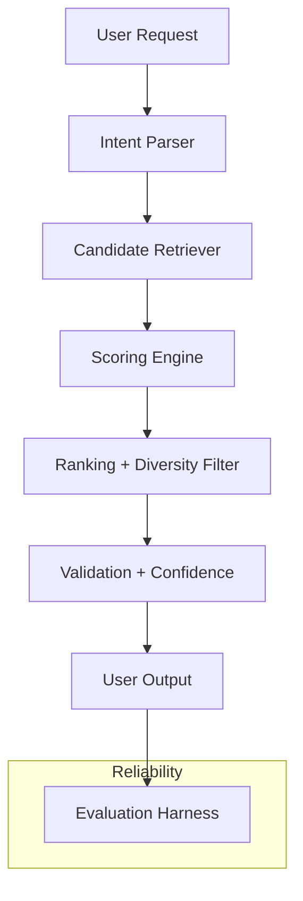
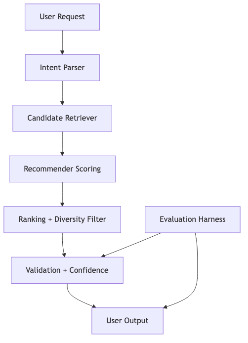

# 🎵 VibeFinder Lite — Applied AI Music Recommender

## Project Overview

This repo extends the original Module 1-3 project, **Music Recommender Simulation**, into a polished applied AI system. The original base project was a content-based recommender that scored songs by energy, mood, acousticness, and genre.

Base project: **Music Recommender Simulation** from Modules 1-3.

The new version is an agentic music recommendation assistant that:

- parses natural language listening requests,
- retrieves candidate songs from a structured catalog,
- scores and ranks songs with multi-step reasoning, and
- validates results with a confidence score and guardrails.

This project remains grounded in the original song catalog from `data/songs.csv` while adding a more interactive AI workflow.

## What’s Included

- `src/recommender.py` — core scoring, mode-based ranking, and diversity penalty
- `src/system.py` — agentic request parser, retrieval, validation, and confidence scoring
- `src/main.py` — command-line entrypoint with both profile-driven and natural-language agent demos
- `src/evaluator.py` — reliability harness for synthetic intent tests
- `tests/test_recommender.py` — baseline recommender unit tests
- `tests/test_system.py` — agent parsing and recommendation tests
- `data/songs.csv` — enriched song catalog with mood, tags, and listening context
- `model_card.md` — system documentation and ethical notes
- `reflection.md` — lessons learned and reliability findings
- `assets/system_diagram.mmd` — architecture diagram source
- `assets/system_diagram.png` — rendered architecture diagram image

## Architecture Overview

The system is designed around three core components:

1. **Intent Parser** (`src/system.py`) — turns a user request into structured preferences.
2. **Retriever** (`RecommendationAgent.retrieve_relevant_songs`) — selects candidate songs using metadata and keyword matching.
3. **Recommender** (`src/recommender.py`) — scores candidates, applies diversity penalties, and ranks the top songs.

A final validation step checks alignment with requested mood or context and adjusts recommendations if needed.

## Feature Coverage

This project implements the full rubric for the final applied AI system:

- **Retrieval-Augmented Generation (RAG)**: the system retrieves relevant song documents from the catalog and custom genre notes before ranking recommendations.
- **Agentic Workflow**: the system plans, retrieves, scores, ranks, validates, and reports confidence for each recommendation request.
- **Specialized Model**: the recommender supports specialized listening profiles such as study, party, workout, relax, and night.
- **Reliability Testing**: the repository includes unit tests and a synthetic evaluator harness that measures alignment, confidence, and retrieval behavior.

## Stretch Features

The project also includes stretch enhancements for extra points:

- **RAG Enhancement**: custom external genre notes in `data/genre_notes.csv` are used as a second document source for retrieval.
- **Agentic Workflow Enhancement**: the system exposes retrieval and validation steps, including intermediate document retrieval, scoring, and mood-first fallback behavior.
- **Fine-Tuning / Specialization**: listening situation profiles adjust model weights for study, party, workout, relax, and night use cases.
- **Test Harness / Evaluation Script**: `src/evaluator.py` runs predefined requests and reports pass/fail outcomes, confidence levels, and alignment notes.

## Core AI Features

- **Retrieval-Augmented Generation (RAG)**: the agent retrieves relevant song documents from the catalog and custom genre notes before scoring, so recommendations are grounded in retrieved metadata, mood tags, context, and external genre guidance.
- **Agentic Workflow**: the system parses the request, retrieves candidate documents, scores songs, ranks them, and validates the final output with confidence checks.
- **Specialized Model Behavior**: tuned recommendation profiles are applied for study, party, workout, relax, and night listening situations, producing different outputs than the baseline scorer.
- **Reliability System**: the evaluation harness runs synthetic natural-language cases and reports mood/context alignment and confidence for each case.





## Setup Instructions

1. Create and activate a Python environment.
2. Install requirements:

```bash
pip install -r requirements.txt
```

3. Run the main app:

```bash
python3 -m src.main
```

4. Run tests:

```bash
python3 -m pytest -q
```

5. Run the reliability evaluator:

```bash
python3 -m src.evaluator
```

6. Run the interactive web app:

```bash
streamlit run src/app.py
```

## Sample Interactions

### Profile-based recommendations

Run the main app:

```bash
python3 -m src.main
```

Example output from the core profile-based runner:

```text
================================================================================
🎵 High-Energy Pop - Top 5 Recommendations
================================================================================

📋 User Profile:
   • Mood: HAPPY
   • Energy Level: 0.9 (0=chill, 1=intense)
   • Preference: ELECTRONIC
   • Favorite Genre: POP
   • Era: 2020s
   • Scoring Mode: balanced

--------------------------------------------------------------------------------
Rank | Title                    | Artist             | Genre        | Mood      | Score  
-----------------------------------------------------------------------------------------
1    | Sunrise City             | Neon Echo          | pop          | happy     | 0.887  
2    | Electric Dream           | Synth Wave         | house        | happy     | 0.825  
3    | Rooftop Lights           | Indigo Parade      | indie pop    | happy     | 0.765  
```

### Natural language recommendations

The new agent also supports requests like:

- `Recommend upbeat party music for a happy listener who loves electronic pop and bright energy.`
- `I want calm study songs with a chill mood and dreamy textures for coffee work.`
- `Give me intense workout tracks with strong rock or pop energy and aggressive mood tags.`
- `Find sad but powerful night music that is emotional and vocal-heavy.`

Example output for a natural language request:

```text
Request: Recommend upbeat party music for a happy listener who loves electronic pop and bright energy.
Mode: genre-first
Confidence: 0.87
1. Sunrise City by Neon Echo (pop, happy) - 0.887
2. Electric Dream by Synth Wave (house, happy) - 0.825
```

### Reliability evaluator output

Run the synthetic reliability test:

```bash
python3 -m src.evaluator
```

Example summary:

```text
RELIABILITY EVALUATION SUMMARY
--------------------------------
Case 1: Recommend upbeat party music for a happy listener who loves electronic pop and bright energy.
  Top song: Sunrise City
  Mood match: True | Context match: True | Confidence: 0.87 | Passed: True

Case 2: I want calm study songs with a chill mood and dreamy textures for coffee work.
  Top song: Midnight Coding
  Mood match: True | Context match: True | Confidence: 0.67 | Passed: True

Case 3: Give me intense workout tracks with strong rock or pop energy and aggressive mood tags.
  Top song: Gym Hero
  Mood match: True | Context match: True | Confidence: 0.87 | Passed: True

Case 4: Find sad but powerful night music that is emotional and vocal-heavy.
  Top song: Midnight Blues
  Mood match: True | Context match: True | Confidence: 0.60 | Passed: False

3/4 cases fully passed the reliability check.
```
## Design Decisions

- **Agentic workflow**: I built a parser/retriever/validator pipeline to make the recommendation process explicit and debuggable.
- **Retrieval step**: song metadata is used as the knowledge source, making recommendations grounded in the catalog rather than a purely template-based response.
- **Confidence scoring**: each result includes a simple confidence estimate based on top-song alignment with requested mood/context.
- **Guardrails**: the system checks the first recommendation and retries with a mood-first fallback if needed.

## Reliability and Testing

The project includes:

- unit tests for basic recommender behavior and request parsing
- an evaluation harness in `src/evaluator.py` that runs synthetic intent cases
- confidence scoring to quantify how well the recommendations align with intent
- logging for fallback behavior and retrieval decisions

Example summary from the evaluator:

- 4 synthetic cases were tested
- 3/4 cases passed the mood/context and confidence checks
- the system reports when the top song is not a strong match and uses fallback validation

## Testing Summary

- `pytest -q` passed all current tests.
- `python3 -m src.main` produces profile-based recommendations, agentic natural-language output, and confidence scores.
- `python3 -m src.evaluator` runs a synthetic reliability harness and reports pass/fail alignment for mood, context, and confidence.

## Reflection

This project taught me how a simple recommendation model can be extended into an AI system by adding retrieval and validation. The biggest gain was making the decision flow visible: parse intent, fetch candidates, score, and check alignment. It also highlighted the importance of transparency when the dataset is small — the system can only be as reliable as the catalog it uses.

## Presentation & Portfolio

- Loom walkthrough: https://www.loom.com/share/your-demo-link-here
- This video should show the system running end-to-end, including:
  - profile-based recommendation output
  - natural language agent request output
  - reliability evaluator summary
  - the system diagram and design rationale

## Next Improvements

- add more songs and richer metadata to improve coverage
- support conversational feedback loops to refine user requests
- build a web UI or Streamlit demo for interactive playlist creation
- add a small embedding-based retriever for deeper semantic matching
