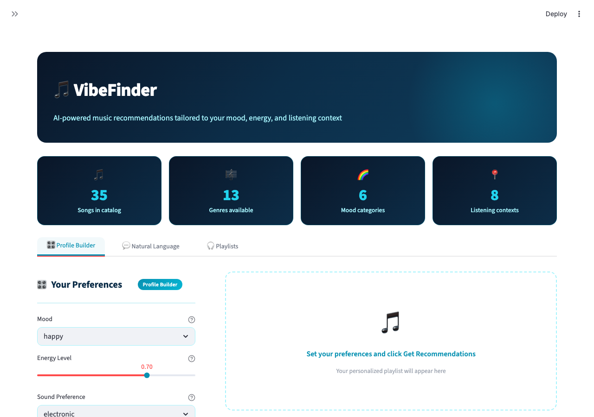
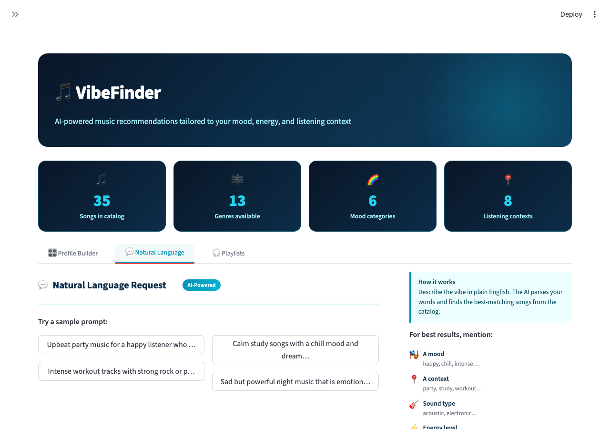
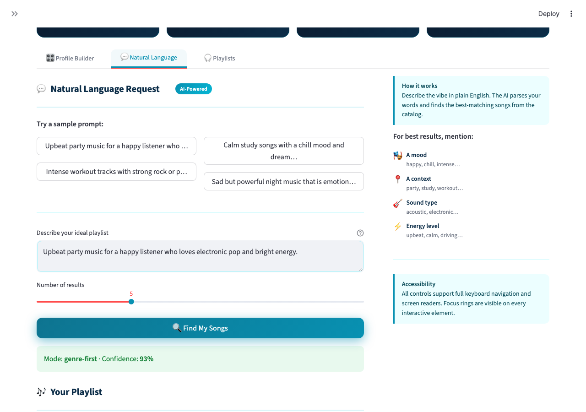
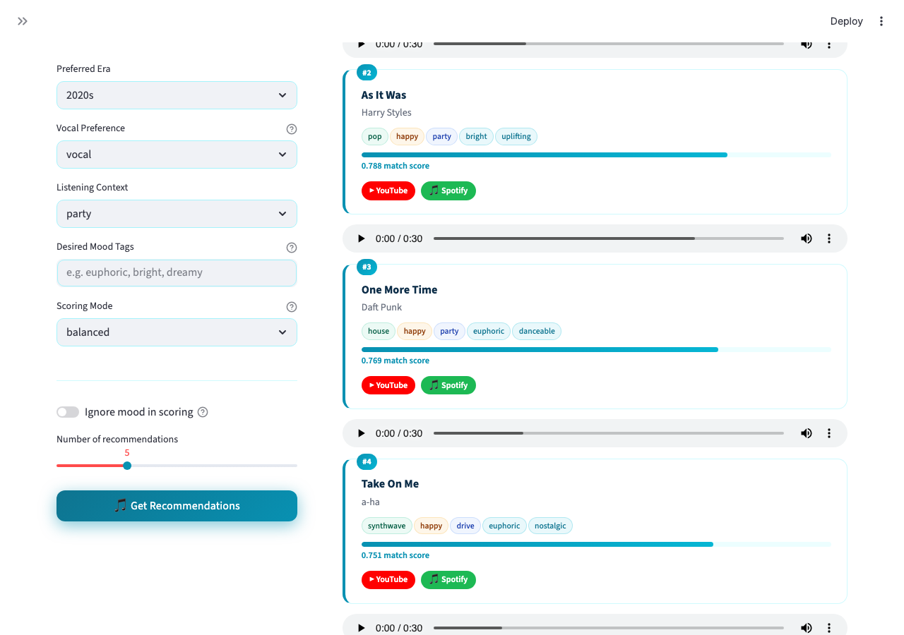
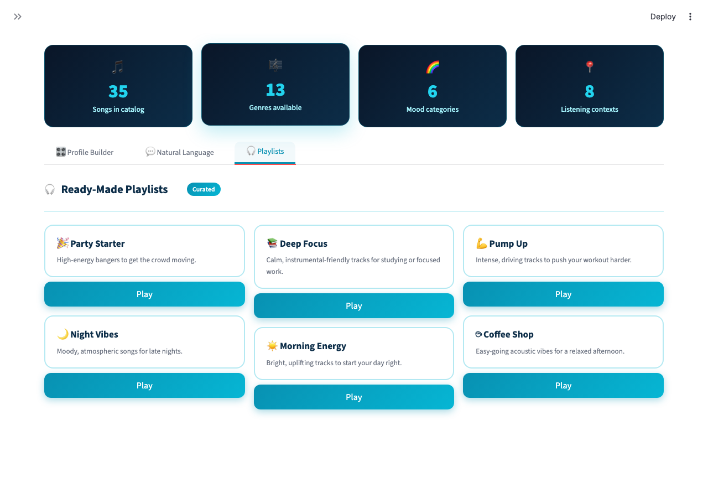
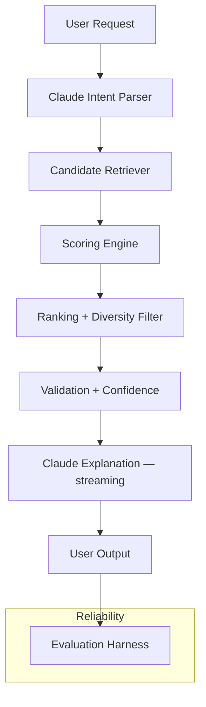

# 🎵 VibeFinder Lite

### An Agentic AI Music Recommender powered by Claude

---

## What It Does

VibeFinder Lite is an AI-powered music recommendation assistant. You describe what you want to hear — a mood, a vibe, a moment — and it builds you a playlist with an explanation for why each song fits.

- Natural language input parsed by **Claude** into structured preferences
- Songs retrieved from a curated catalog and scored with multi-step reasoning
- Confidence scoring and guardrails to validate results
- Streaming explanation from Claude for every recommendation

---

## App Preview

**Home — Stats & Profile Builder**


**Natural Language Request — AI-Powered**


**NL Results with Confidence Score**


**Profile Builder Results — Ranked Songs with Match Scores**


**Ready-Made Playlists**


---

## Video Walkthrough

[](https://www.loom.com/share/4190bc0d238745ada35a814a835d8754)

> The walkthrough covers: profile-based recommendations, natural language agent output, confidence scoring, and the system design rationale.

---

## Architecture



| Component | File | Role |
|---|---|---|
| Claude Intent Parser | `src/claude_client.py`, `src/system.py` | Parses natural language into mood, energy, genre, context |
| Retriever | `src/system.py` | Selects candidates via metadata + keyword matching |
| Recommender | `src/recommender.py` | Weighted scoring, diversity penalty, ranking |
| Explanation | `src/claude_client.py` | Streams a 2–3 sentence playlist explanation |

---

## Key Features

- **Claude API — Structured Mood Parsing** — natural language like *"I'm feeling nostalgic and melancholic tonight"* is sent to Claude with a Pydantic JSON schema; returns validated structured preferences. Falls back to keyword matching without an API key.
- **Claude API — Streaming Explanation** — after ranking, Claude streams a warm explanation of why the playlist fits. Shown in the "Why these songs?" section of the web app.
- **RAG** — retrieves song documents and custom genre notes from `data/genre_notes.csv` before scoring.
- **Agentic Workflow** — parse → retrieve → score → rank → validate → explain.
- **Listening Profiles** — tuned weights for study, party, workout, relax, and night.
- **Tone Adaptation** — detects casual, friendly, or formal tone cues and adapts phrasing.
- **Reliability Harness** — `src/evaluator.py` runs synthetic intent cases and reports mood/context alignment and confidence.

---

## Project Structure

```
src/
  claude_client.py   — Claude API integration (mood parsing + streaming explanation)
  recommender.py     — scoring, ranking, diversity penalty
  system.py          — agentic pipeline: parse, retrieve, validate, confidence
  main.py            — CLI entrypoint
  evaluator.py       — reliability harness
app.py               — Streamlit web UI
tests/               — unit + agent tests
data/songs.csv       — song catalog
data/genre_notes.csv — external genre notes for RAG
```

---

## Setup

```bash
pip install -r requirements.txt
export ANTHROPIC_API_KEY=your_key_here
```

> Without an API key the app still works — it falls back to keyword-based parsing and skips the AI explanation.

**Run the CLI:**
```bash
python3 -m src.main
```

**Run tests:**
```bash
python3 -m pytest -q
```

**Run the reliability evaluator:**
```bash
python3 -m src.evaluator
```

**Run the web app:**
```bash
streamlit run app.py
```

---

## Sample Output

### Profile-based

```
🎵 High-Energy Pop - Top 5 Recommendations

User Profile:
   • Mood: HAPPY  • Energy: 0.9  • Genre: POP  • Era: 2020s

Rank | Title          | Artist        | Genre    | Mood  | Score
1    | Sunrise City   | Neon Echo     | pop      | happy | 0.887
2    | Electric Dream | Synth Wave    | house    | happy | 0.825
3    | Rooftop Lights | Indigo Parade | indie pop| happy | 0.765
```

### Natural language

```
Request: Recommend upbeat party music for a happy listener who loves electronic pop.
Mode: genre-first  |  Confidence: 0.87

1. Sunrise City by Neon Echo (pop, happy) — 0.887
2. Electric Dream by Synth Wave (house, happy) — 0.825
```

### Reliability evaluator

```
RELIABILITY EVALUATION SUMMARY
Case 1: upbeat party music — Top: Sunrise City — Passed ✓
Case 2: calm study songs  — Top: Midnight Coding — Passed ✓
Case 3: intense workout   — Top: Gym Hero — Passed ✓
Case 4: sad night music   — Top: Midnight Blues — Failed ✗

3/4 cases passed the reliability check.
```

---

## Reflection

The biggest gain in this project was making the decision flow visible — parse intent, fetch candidates, score, validate — instead of treating the model as a black box. It also highlighted that an AI layer is only as reliable as the data underneath it.

---

## Links

- GitHub: https://github.com/kneha07/applied-ai-music-system
- Demo video: https://www.loom.com/share/4190bc0d238745ada35a814a835d8754

---

## What's Next

- Richer catalog with more metadata coverage
- Conversational feedback loop so Claude can ask clarifying questions
- Embedding-based retriever for semantic matching
- Claude tool use to let the agent query the catalog dynamically
